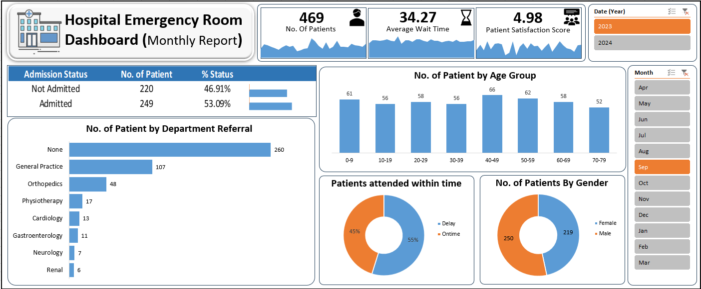

# Hospital-Emergency-Room-Analysis
The Hospital Emergency Room Analysis Dashboard is an interactive tool that analyzes emergency room operations, providing insights into patient flow, wait times, admissions, and department referrals. Using data visualization, it helps healthcare professionals identify trends, optimize resources, and enhance patient care efficiency.
# Hospital ER Analysis Dashboard

## Project Overview
The **Hospital Emergency Room Analysis Dashboard** is designed to enhance operational efficiency in emergency rooms by providing real-time insights into patient flow, wait times, and key performance indicators (KPIs). This dashboard helps healthcare professionals monitor trends, improve decision-making, and optimize patient care.

## Dashboard Preview
  

## Requirements & Key Metrics
The dashboard tracks critical KPIs for improved hospital management:

- **Total Number of Patients:** Daily patient visit count with peak trend analysis.
- **Average Wait Time:** Time patients spend waiting before consultation.
- **Patient Satisfaction Score:** Measurement of overall patient experience.
- **Admission Status:** Comparison of admitted vs. non-admitted patients.
- **Patient Age Distribution:** Breakdown of patients into different age groups.
- **Timeliness Metric:** Percentage of patients attended to within the expected time.
- **Gender & Department Referrals:** Insights into patient demographics and department-wise referrals.

For detailed project requirements, refer to [`Requirement Document.docx`](Requirement Document.docx).

## Data Source
The analysis uses **Hospital Emergency Room Data.csv**, which includes:
- Patient visit records  
- Admission status and department referrals  
- Wait times and satisfaction scores  
- Demographic details  
